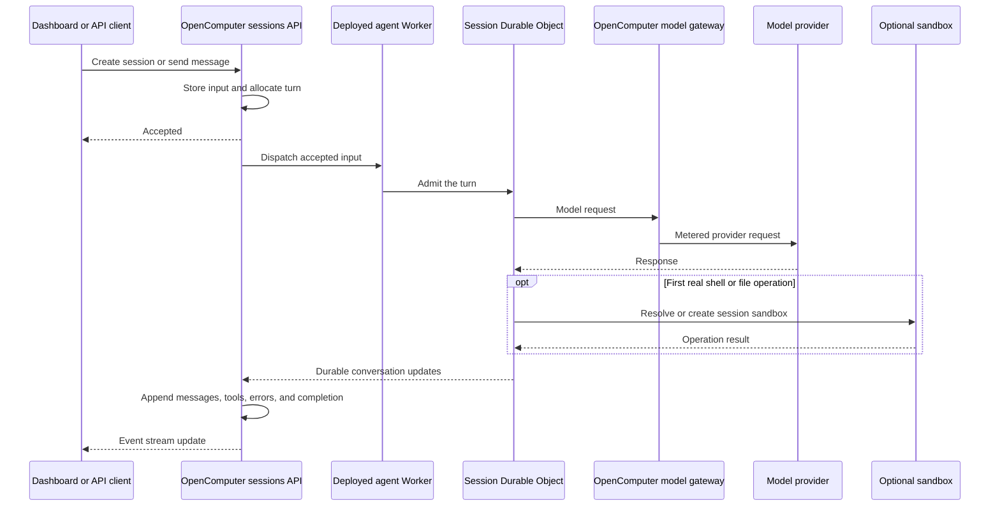

<Note>
**Experimental.** The supported profile is intentionally narrow. It currently covers direct text
sessions on managed Anthropic models, with an optional OpenComputer sandbox. Flue is pre-1.0, and
each deployment includes the exact Flue version installed in your app.
</Note>

[Flue](https://flueframework.com) is a TypeScript framework for durable agents. OpenComputer runs the
application Flue builds and connects it to OpenComputer agents, sessions, events, steering, model
billing, and optional sandboxes.

Starter: [`diggerhq/oc-flue-starter`](https://github.com/diggerhq/oc-flue-starter) · [Fork on GitHub](https://github.com/diggerhq/oc-flue-starter/fork)

## How Flue differs from the built-in runtimes

The built-in runtimes run Claude Code, Codex, or pi as a managed coding agent. A Flue agent is
different: **your application is the runtime**. OpenComputer deploys and operates that app.

| Concern | Built-in runtimes | Flue |
| --- | --- | --- |
| Agent loop | OpenComputer runs Claude Code, Codex, or pi | Your compiled Flue app contains the loop |
| Session compute | Managed per-session brain and workspace sandboxes | One deployed app, with one Durable Object instance per session |
| Conversation state | Checkpointed runtime files plus the OpenComputer event log | Flue stores its conversation in Durable Object SQLite; OpenComputer projects public milestones into its event log |
| Tools and skills | Platform tools plus uploaded `prompt.md` and `skills/` | `defineTool` code and packaged skill imports compiled into the Worker |
| Linux workspace | Part of the normal runtime | Absent by default; `ocSandbox` creates one only when an operation needs it |
| Deployment | Upload prompt, model, and skill configuration | Build and deploy the compiled app |

Under the hood, OpenComputer runs Flue's Cloudflare target as an agent Worker and gives each session
its own Durable Object. This architecture lets a Flue session start without provisioning a virtual
machine. A model-only agent, or one whose custom tools use bundled data, never needs a sandbox.

## How a turn runs



OpenComputer returns after it has durably accepted the input. It does not wait for dispatch, the
Durable Object, a model call, or sandbox creation. Flue executes one turn at a time for each session;
messages sent while a turn is working remain queued and run in order.

Flue's Durable Object is the runtime's conversation store. The OpenComputer event log is the stable
consumer view used by the dashboard, API, and webhooks. OpenComputer resumes projection from a saved
cursor after an interruption, so clients do not need to understand Flue submission ids or stream
offsets.

## Deploy from GitHub

The shortest path for an existing Flue app is the dashboard:

1. Fork the [Flue starter](https://github.com/diggerhq/oc-flue-starter/fork), or push your own app to GitHub.
2. Open **Agents → Create agent → Import from GitHub**.
3. Install the OpenComputer GitHub App on the repository, then select the repository, production branch, and root directory.
4. Choose **Review agent**. OpenComputer resolves one exact commit and checks the root without running repository code.
5. Review the detected Flue entrypoint and model. Give the OpenComputer agent a human-readable name; it may differ from the `agent.toml` Flue entrypoint.
6. Choose **Deploy agent**. The deployment page opens immediately, keeps one chronological log, and summarizes progress as **Prepare**, **Build**, and **Deploy**.

The selected root is its own build context and must contain `agent.toml`, `package.json`, and a
committed `package-lock.json`. The package must declare a Node engine compatible with the exact
managed builder version and a semver dependency on the Flue CLI. npm workspaces,
files above the selected root, private registries, submodules, Git LFS, custom install/build
commands, and build-time secrets are not supported.

`agent.toml` is authoritative. If it is malformed, declares an unsupported runtime, or is missing
from a root that otherwise has strong Flue markers, review returns **This Flue agent needs a fix**.
OpenComputer does not fall back to generated behavior or another runtime. A prompt- or skills-only
folder is unrecognized; use a complete Flue root, choose another folder, fork the starter, or create
a built-in agent manually.

For a monorepo, reviewing an unrecognized parent can suggest bounded candidate roots. Selecting a
candidate changes the root and performs a fresh review—it never deploys the suggestion automatically.

OpenComputer resolves the selected branch to one commit, fetches only that tracked tree in a
short-lived Git sandbox, and transfers tokenless source to a separate build sandbox. The build runs
fixed `npm ci --no-audit --no-fund` and offline `oc agent build` commands in an ordinary disposable
OpenComputer sandbox. The build request carries no GitHub token, OpenComputer key, model
credential, Workers credential, or secret store.

<Note>
Repository import creates the initial deployment from the selected production branch. Each later
push to that branch that touches the selected root automatically creates another deployment for the
new exact commit. Flue ignores pushes to other branches because it has one live Worker and no
preview/staged Worker in the current profile.
</Note>

The review step returns a receipt for the exact source plan. Import re-resolves GitHub authority and
checks that receipt before creating anything. If the branch or a relevant file changed, the dashboard
shows **Repository changed since review** and asks you to review again.

If install or build fails, the agent remains visible but undeployed: it has no usable revision and
cannot start a session. Open the failed deployment for its persisted error summary and bounded log,
fix the repository, and push the linked production branch. The first successful deployment creates
revision **#1**. **Deploy latest** can manually rebuild its current head after a transient platform
failure.

If a later production push removes or replaces the Flue definition, the deployment stops before
build with `source_profile_changed`; the active revision stays live. Restore the Flue app in the
linked root, or unlink the source and import the repository as a new agent. Unlinking does not delete
the existing agent, its active revision, or its sessions.

## Deploy from your machine

Requirements: Node 22.19 or newer, the `oc` CLI, and an OpenComputer organization with Managed model
access.

```sh
git clone https://github.com/diggerhq/oc-flue-starter
cd oc-flue-starter
npm install

# Builds the Cloudflare target, deploys it, verifies the live Worker, and activates a revision.
# The agent is created from agent.toml when it does not exist yet.
oc agent deploy

oc session create \
  --agent support-triage \
  --input "Order 2203 arrived with a torn shoulder strap. What happens next?"
```

Continue the session with `oc session steer <session-id> "..."`, inspect it with
`oc session logs <session-id>`, or open it in the
[dashboard](https://app.opencomputer.dev).

### Validate or build without deploying

The CLI exposes the same credential-free artifact builder used by managed repository builds:

```sh
# Reads and validates source without installing dependencies or running repository code.
oc agent build --dir . --check-only --json

npm ci
oc agent build \
  --dir . \
  --target cloudflare \
  --output /tmp/flue-build \
  --json
```

The full command writes `bundle.tgz` and `deployment.json`. It does not fetch source, install
dependencies, authenticate, upload, or deploy; `npm ci` is intentionally a separate step.

## Add OpenComputer to a Flue app

Install the integration alongside Flue:

```sh
npm install @opencomputer/flue
```

Export the OpenComputer route and register the managed model gateway inside your agent initializer:

```ts src/agents/support-triage.ts
import { defineAgent, defineAgentProfile } from '@flue/runtime';
import { DEFAULT_MODEL, route, useOcGateway } from '@opencomputer/flue';

export { route };

export default defineAgent((ctx) => {
  useOcGateway(ctx);

  return {
    profile: defineAgentProfile({
      instructions: 'Triage customer requests and give the next concrete action.',
    }),
    model: DEFAULT_MODEL,
  };
});
```

Use the default hosting app, which mounts Flue's routes, the deployment health endpoint, and
OpenComputer telemetry:

```ts src/app.ts
export { default } from '@opencomputer/flue/app';
```

Declare the deployment target:

```toml agent.toml
name = "support-triage"
model = "anthropic/claude-haiku-4-5"

[runtime]
family = "flue"
```

The manifest name must identify the exported Flue agent, and its model must match the model returned
by `defineAgent`. `DEFAULT_MODEL` currently resolves to `anthropic/claude-haiku-4-5`.

If your project owns a custom `app.ts`, keep Flue's routes, import `@opencomputer/flue/wire` for
telemetry, and expose a `GET /health` route that returns success. The default app is the simpler
choice when you do not need additional routes.

## What `@opencomputer/flue` supplies

| Export | Purpose |
| --- | --- |
| `useOcGateway(ctx)` | Registers the managed Anthropic endpoint inside the Flue initializer |
| `route` | Opts an agent into the HTTP transport used by managed dispatch |
| `DEFAULT_MODEL` | Selects the supported prompt-caching-safe default model |
| `@opencomputer/flue/app` | Provides Flue routes, `GET /health`, and telemetry wiring |
| `@opencomputer/flue/wire` | Adds telemetry when your project owns its hosting app |
| `ocSandbox(ctx.env)` | Adds an optional, demand-driven Linux shell and filesystem |

OpenComputer binds a platform-managed credential for its gateway during deployment. Your provider
key is not compiled into the app or exposed to the Worker.

## Custom tools and packaged skills

Custom `defineTool` handlers run inside the Worker. Import any data or templates they need so the
Cloudflare build includes those files:

```ts src/tools/lookup-order.ts
import { defineTool } from '@flue/runtime';
import * as v from 'valibot';
import orders from '../data/orders.json' with { type: 'json' };

export const lookupOrder = defineTool({
  name: 'lookup_order',
  description: 'Look up an order by id.',
  input: v.object({ order_id: v.string() }),
  run({ input }) {
    return (orders as Record<string, unknown>)[input.order_id] ?? { found: false };
  },
});
```

Package an agent-owned skill through Flue's supported import mechanism, then add it to the agent:

```ts
import triage from '../skills/triage/SKILL.md' with { type: 'skill' };

// Inside the object returned by defineAgent:
{
  tools: [lookupOrder],
  skills: [triage],
}
```

The skill is part of the Worker module graph. It is not copied into a workspace, and loading it does
not require a sandbox. Changing a tool, imported data file, or packaged skill requires another
deployment.

Custom tools in the Worker can currently reach only platform-managed outbound hosts. Arbitrary
external `fetch` destinations are not part of the supported profile. Commands run through an
optional OpenComputer sandbox follow the sandbox's separate network policy.

## Optional sandbox

Add `ocSandbox` only when the agent needs a Linux shell or durable files:

```ts
import { defineAgent, defineAgentProfile } from '@flue/runtime';
import {
  DEFAULT_MODEL,
  ocSandbox,
  route,
  useOcGateway,
} from '@opencomputer/flue';

export { route };

export default defineAgent((ctx) => {
  useOcGateway(ctx);

  return {
    profile: defineAgentProfile({
      instructions: 'Work in the sandbox only when a shell or file operation is needed.',
    }),
    model: DEFAULT_MODEL,
    sandbox: ocSandbox(ctx.env),
  };
});
```

Declaring `ocSandbox` performs no provisioning during Worker startup or Flue runtime initialization.
The first real shell or file operation resolves one sandbox for the session; later operations and
turns reuse it.

The workspace starts empty. Repository sources and workspace skill discovery are not implemented for
Flue sessions, so passing `sources` at session creation is rejected.

## Variables and secrets

Non-secret Worker variables belong in `agent.toml`:

```toml agent.toml
[vars]
SUPPORT_REGION = "eu-west"
```

Pipe secret values over standard input. Values are write-only and never returned by the API:

```sh
printf '%s' "$SUPPORT_API_KEY" | oc agent secret set SUPPORT_API_KEY --from-stdin
oc agent secret list

# A configuration change takes effect on the next deployment.
oc agent deploy
```

Deleting a secret also requires a deployment before the Worker changes:

```sh
oc agent secret delete SUPPORT_API_KEY
oc agent deploy
```

Binding names use uppercase letters, digits, and underscores. Names beginning with `OC_` or `FLUE_`
are reserved for the platform. Never put a secret in `agent.toml` or source code.

## Deployment and revision behavior

A **deployment** is one time-aware attempt and can fail. A **revision** exists only after that
attempt verifies successfully. Managed repository deployments persist one chronological log across
the `queued`, `fetching`, `validating`, `installing`, `building`, `uploading`, `deploying`, and
`verifying` states. Refreshing the dashboard does not lose that log.

`oc agent deploy` performs these operations:

1. Scans the source tree for credential-shaped values.
2. Runs the app's installed `flue build --target cloudflare`.
3. Uploads only the generated JavaScript modules and a restricted deployment descriptor.
4. Applies platform-owned bindings, variables, secrets, and Durable Object migrations, then uploads
   the agent Worker.
5. Keeps the deployment in `verifying` until the exact live Worker returns two consecutive healthy
   responses. Only then does the CLI report the revision as ready.

<Warning>
Flue currently has one live Worker per agent. Uploading a deployment changes the code used by new and
existing sessions before revision verification finishes. There is no isolated staged Worker, canary
route, or automatic Worker rollback. `--no-activate`, an old revision pin, and a pointer-only
`oc agent rollback` do not restore older Worker code.

From the live-upload guard until verification finishes, new session creation and new input return the
retryable `503 flue_deployment_updating`; retry after the deployment becomes terminal. If an upload
cannot be verified, the live state becomes `unverified` and those paths remain blocked until a later
deployment restores verified code (`503 flue_deployment_unverified`). Work already running inside a
Durable Object is not version-pinned and can also be affected by the Worker change.

To restore a known-good build, check out that source and run `oc agent deploy` again. Flue and Durable
Object schema changes are forward-only, so do not downgrade across an incompatible Flue storage
version.
</Warning>

## Session behavior

Flue uses the same session ids, text input, event stream, steering, cancellation, result endpoint,
and dashboard as the other runtimes. The important differences are:

- Session creation and steering return after durable acceptance. Model execution continues
  asynchronously.
- Each accepted input receives an OpenComputer `trn_...` id. Flue's internal submission identity is
  not part of the public API.
- Follow-up messages queue behind the working turn and run in order.
- The model is compiled into the deployed app. Per-session model overrides are rejected.
- Generic `tokens`, `turn_seconds`, and `turns` limits are not yet enforced on the Flue execution
  path. Do not use them as a safety boundary for this runtime.
- Archiving makes the OpenComputer session read-only but retains the Flue conversation in Durable
  Object storage. Each session is subject to Cloudflare's
  [10 GB Durable Object storage limit](https://developers.cloudflare.com/durable-objects/platform/limits/).

## Current limitations

- Direct text session messages are the supported ingress. Flue channels and workflows are not
  connected to OpenComputer yet.
- Repository sources, checkout, pull-request publishing, watches, and repo-backed workspaces are not
  supported for Flue sessions.
- Repository deployment accepts one self-contained npm root with a committed npm lockfile. Pushes
  to its linked production branch deploy automatically; preview branches and staged Flue Workers are
  not supported.
- The reviewed entrypoint, model, and variables are guarded. Changing those behavior-bearing
  manifest fields is rejected until existing-agent re-review is available; keep them stable after
  import for now.
- File and image attachments are not supported.
- The managed gateway currently supports Anthropic models and requires Managed model access for the
  organization. Per-session model selection is not supported.
- Worker code has a platform-managed outbound allowlist. Tenant-configurable egress is not available.
- Platform turn deadlines, maximum-turn enforcement, automatic conversation compaction, and
  automatic tenant-Worker rollback are not available yet.
- Subagents may execute inside Flue, but their event projection and lifecycle are outside the tested
  profile.

## Troubleshooting

- **Repository inspection fails**: confirm the GitHub App can read the repository, the selected
  branch and root exist, and the root contains `agent.toml`, `package.json`, and `package-lock.json`.
- **Managed install or build fails**: open the deployment detail page. The safe error summary remains
  available even if log output was truncated; fix the source and push the production branch again.

- **`flue build` is unavailable**: run `npm install` with Node 22.19 or newer. `oc agent deploy` never
  downloads a missing build tool for you.
- **Credential scan refuses the deploy**: remove the reported key from source and store application
  secrets with `oc agent secret set ... --from-stdin`.
- **Deployment fails while verifying**: the uploaded Worker did not reach a stable healthy response.
  Inspect the deployment error, correct the import-time or health-route failure, and deploy again.
- **Provider authentication fails on the first turn**: confirm that Managed model access is active for
  the organization and that the agent uses an `anthropic/...` model.
- **A skill is missing**: import its `SKILL.md` with `with { type: 'skill' }` and include it in the
  agent's `skills` array.
- **A session shows an error or stops advancing**: inspect the dashboard's **All events** view or run
  `oc session logs <session-id>`. Runtime failures are recorded without requiring a diagnostic
  redeployment.
