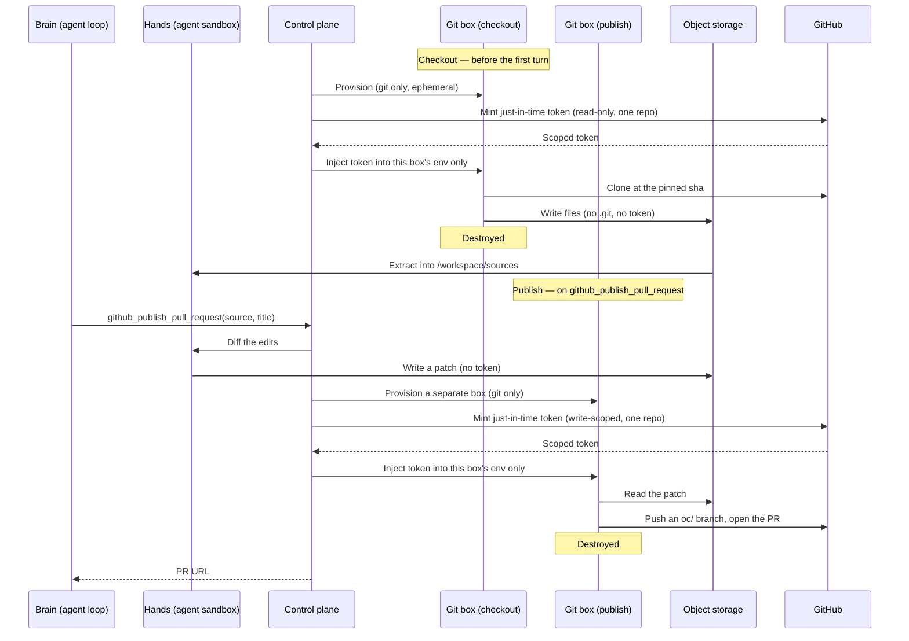

Use Repos when a session needs private code. Giving an agent a GitHub token,
authenticated remote, or `gh` session gives it whatever that token can do; hiding the
token behind a proxy does not narrow that authority.

Repos make GitHub access operation-scoped. A **Repo** is a stable repository handle
(owner/repo) that resolves to the OpenComputer App; a **Source** pins `ref` and `sha`.
OpenComputer checks out the exact commit in a short-lived **Git operations sandbox**,
copies only files into `/workspace/sources/<name>`, and destroys the token. For writes, the
agent edits files and calls the
[`github_publish_pull_request`](/agent-sessions/runtime-tools#github-tools) runtime tool;
OpenComputer commits and opens the PR outside the agent sandbox with a fresh, write-scoped
token.

<Note>**Preview** — APIs may change before general availability.</Note>

## Concepts

| Concept | Role | Boundary |
| --- | --- | --- |
| GitHub App | Mints operation-scoped GitHub tokens. | Not session refs. |
| Installation | GitHub account and repo selection. | The repos the App may work in. |
| Repo | A stable owner/repo handle. | No tokens, private keys, or session refs. |
| Source | `ref`, `sha`, and local name for one session. | Auth comes from the OpenComputer App unless inline. |
| Git operations sandbox | Runs authenticated clone/fetch/publish work. | Separate from the agent; token lives only for one operation. |

<Note>
`Repo` and `Source` are provider-neutral: `provider`, `owner`, `repo`, `ref`, `sha`.
GitHub uses GitHub Apps as its auth surface. Other providers can add their own auth
surface while sessions continue to reference repos and sources the same way.
</Note>

## How it works

Every authenticated Git operation runs in its own **Git operations sandbox** — a minimal
box with `git` and nothing else, provisioned for that one operation and destroyed when it
finishes. Checkout and publish get *different* boxes. Your agent's own sandboxes — the
**brain** that runs the loop and the **hands** sandbox that holds the files — are never one
of these: they hold no token and never run authenticated `git` or `gh`. Files and patches
move between them through object storage, never next to a credential.



**Checkout (read), before the first turn:**

1. OpenComputer provisions a fresh Git operations sandbox for the checkout.
2. The control plane mints a **just-in-time token**: the GitHub App requests an installation
   token scoped to that one repo with read-only contents permission, and it is injected into
   the sandbox's environment only — never `.git/config`, the command line, or any log.
3. The sandbox clones the exact `sha`, then writes the **files** (no `.git`, no remote, no
   token) to dedicated object storage.
4. The sandbox is destroyed; the token dies with it.
5. The **hands** sandbox extracts those bytes into `/workspace/sources/<name>`.

**Publish (write), when the agent calls `github_publish_pull_request`:**

1. The **hands** sandbox turns its edits into a patch and writes it to object storage. The
   agent still has no token.
2. OpenComputer provisions a **new** Git operations sandbox and mints a fresh,
   **write-scoped** token for that one repo.
3. The sandbox applies the patch on an `oc/<session>/<source>-<id>` branch, pushes, and
   opens the PR.
4. The sandbox is destroyed; the token dies with it. The PR URL is returned to the agent.

The token is minted per operation, scoped to a single repo, lives only inside a box that
does nothing but Git, and is gone before the next turn.

## The OpenComputer GitHub App

In preview, the OpenComputer App is the only GitHub App: OpenComputer owns the App key and
mints a fresh, narrowly-scoped token for each operation, so you get private repo access with
no App key handling.

Each operation asks for the minimum GitHub permission it needs. Checkout needs read-only
contents access; write-capable actions ask for write access only for that operation.

**Install the [OpenComputer GitHub App](https://github.com/apps/opencomputerdev/installations/new)**
on the repositories you want OpenComputer to work with — you choose the exact repos, so it
never needs org-wide access. Once it's installed on a repo, reference that repo in a session's
`sources` (below) and OpenComputer resolves the App and mints a token just in time. You do not
need to enumerate installations to use a repo.

<Warning>
The App may request write-capable GitHub permissions on the repos you select. OpenComputer
does **not** hand that broad authority to the agent: each operation gets a fresh token with
the minimum permission it needs, such as read-only for checkout and write only for a
publish/comment action.
</Warning>

### Bring your own GitHub App (coming later)

<Note>
**Not yet available.** Bring-your-own GitHub App modes — `byo_stored_key` (OpenComputer
stores your App key encrypted and mints) and `byo_broker` (your backend owns the App key and
returns short-lived tokens) — are planned so that GitHub PRs, comments, and statuses can come
from your own App. In preview, only the OpenComputer App is available.
</Note>

### Inline short-lived token

The no-setup path is to pass a real short-lived token inline on the source, using the
deliberately-named `risky_short_lived_token` auth. An inline token is **checkout-only**:
it is used once to check the repo out and then purged, so it **cannot publish or open
PRs**. Publishing requires a configured GitHub App — [install the OpenComputer App](https://github.com/apps/opencomputerdev/installations/new).

<CodeGroup>

```ts TypeScript SDK
sources: [{
  url: "https://github.com/acme/web.git",
  ref: "refs/pull/42/head",
  sha: "abc123…",
  auth: {
    type: "risky_short_lived_token",
    token: "ghs_…",
    expiresAt: "…",
  },
}]
```

```json REST API
"sources": [{
  "url": "https://github.com/acme/web.git",
  "ref": "refs/pull/42/head",
  "sha": "abc123...",
  "auth": {
    "type": "risky_short_lived_token",
    "token": "ghs_...",
    "expires_at": "..."
  }
}]
```

</CodeGroup>

<Warning>
The inline token is **checkout-only** — it checks the repo out once and is then purged, so
it **cannot publish or open PRs** (publishing requires a configured GitHub App). It also
**can't refresh**, so use it only for sessions that finish within the token's life.
OpenComputer rejects a far-future or missing expiry and holds the token encrypted only
until the first checkout, then purges it. Use this only when a GitHub App is not configured.
</Warning>

## Register a repo

Once the [OpenComputer GitHub App](https://github.com/apps/opencomputerdev/installations/new)
is installed on a repo, register a repo — optional: any installed repo can
be used in a session directly; a Repo gives you a stable handle to reference.

<CodeGroup>

```ts TypeScript SDK
const repo = await oc.repos.create({
  owner: "acme",
  repo: "web",
});
```

```http REST API
POST /v3/repos
Authorization: Bearer $OPENCOMPUTER_API_KEY

{ "provider": "github", "owner": "acme", "repo": "web" }
```

</CodeGroup>

Get-or-create, owner-scoped, idempotent by `(provider, owner, repo)`. **No credential is
passed** — auth resolves through the OpenComputer App. (Pinning a repo to a specific App is
coming later.)

## Use it in a session

<CodeGroup>

```ts TypeScript SDK
const session = await oc.sessions.create({
  agent: agent.id,
  input: "Review this pull request.",
  sources: [{
    repo: repo.id,
    ref: "refs/pull/42/head",
    sha: "abc123…",
    name: "head",
  }],
});
// checked out at /workspace/sources/head before the first turn
```

```http REST API
POST /v3/sessions
Authorization: Bearer $OPENCOMPUTER_API_KEY

{
  "agent": "agt_...",
  "input": "Review this pull request.",
  "sources": [{
    "repo": "repo_...",
    "ref": "refs/pull/42/head",
    "sha": "abc123...",
    "name": "head"
  }]
}
```

</CodeGroup>

- **`ref`** (required) — the fetch ref (a branch or `refs/pull/N/head`); a private SHA
  can't be fetched directly.
- **`sha`** (required) — the exact commit, pinned and verified after fetch.

You can also reference `"owner/repo"` directly instead of a registered id. A session can
list several immutable sources, such as a PR's base and head.

## Check source status

The create response includes a sanitized source snapshot. Poll `session.listSources()` for
live materialization status:

```ts
const sources = await session.listSources();

for (const source of sources) {
  if (source.status === "auth_required" || source.status === "failed") {
    showSourceError(source.errorCode, source.errorMessage);
  }
}
```

Common `errorCode` values: `source.auth_required`, `source.auth_ambiguous`,
`source.repo_not_selected`, `source.permission_missing`, `source.sha_mismatch`, and
`source.timeout`.

## What the agent can do

After checkout, the agent works with ordinary files. It can inspect, edit, test, diff, and
make local commits. Anything needing GitHub credentials runs outside the agent sandbox, so
the agent never runs authenticated `git`/`gh` and never sees a token.

To open a pull request, the agent calls the
[`github_publish_pull_request`](/agent-sessions/runtime-tools#github-tools) runtime tool —
it is **not** an SDK method; the agent invokes it from inside the sandbox. It takes the
source's local `name` as `source`, a `title`, and optional `body`, `base` (defaults to the
source's checked-out ref), and `draft`, and returns the PR URL. OpenComputer commits the
agent's edits to an `oc/<session>/<source>-<id>` branch and opens the PR with a
just-in-time, write-scoped token. This requires a **configured GitHub App** — the inline
`risky_short_lived_token` path is checkout-only and **cannot** open PRs.

## Guarantees

- **GitHub App-backed tokens are never stored** — OpenComputer obtains short-lived,
  repo-scoped tokens just in time and destroys them. None reaches the agent's prompt,
  shell, files, env, the event log, or telemetry. (The one exception is inline-token auth,
  held encrypted only until the first checkout, then purged.)
- The OpenComputer App's private key lives only in OpenComputer's **control plane**, never
  in a sandbox.
- Platform-mediated pushes use an `oc/<session>/…` branch namespace — **no
  protected-branch push, no force-push.**
- Submodules and Git LFS are not part of the checkout contract.
