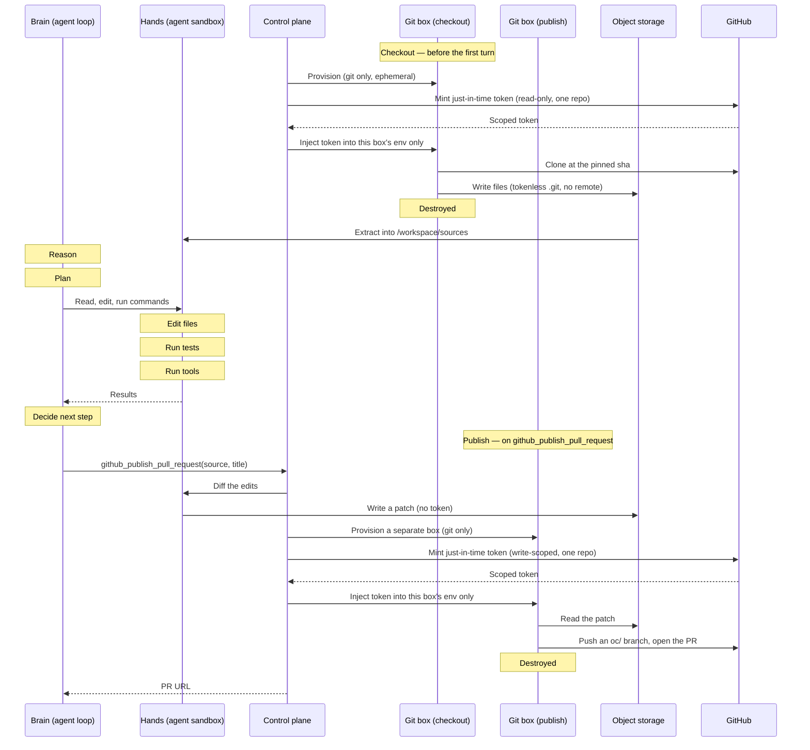

Use Repos when a session needs private code. Giving an agent a GitHub token,
authenticated remote, or `gh` session gives it whatever that token can do; hiding the
token behind a proxy does not narrow that authority.

Repos make GitHub access operation-scoped. A **Repo** is a stable repository handle
(owner/repo) that resolves to your configured GitHub App (the OpenComputer App by default);
a **Source** pins `ref` and `sha`.
OpenComputer checks out the exact commit in a short-lived **Git operations sandbox**,
copies only files into `/workspace/sources/<name>`, and destroys the token. For writes, the
agent edits files and calls the
[`github_publish_pull_request`](/agent-sessions/runtime-tools#github-tools) runtime tool;
OpenComputer commits and opens the PR outside the agent sandbox with a fresh, write-scoped
token.

The same repository identity also powers [Flue repository deployment](/agent-sessions/flue#deploy-from-github),
but the destination is different. Session sources copy code into a running agent's hands sandbox;
a Flue deployment resolves one production commit, hands tokenless source to a separate build
sandbox, and deploys the resulting artifact. Repository credentials reach neither destination.

<Note>**Preview** — APIs may change before general availability.</Note>

## Concepts

| Concept                | Role                                                   | Boundary                                                                                |
| ---------------------- | ------------------------------------------------------ | --------------------------------------------------------------------------------------- |
| GitHub App             | Mints operation-scoped GitHub tokens.                  | Not session refs.                                                                       |
| Installation           | GitHub account and repo selection.                     | The repos the App may work in.                                                          |
| Repo                   | A stable owner/repo handle.                            | No tokens, private keys, or session refs.                                               |
| Source                 | `ref`, `sha`, and local name for one session.          | Auth comes from your configured GitHub App (OpenComputer App by default) unless inline. |
| Git operations sandbox | Runs authenticated clone/fetch/publish work.           | Separate from the agent; token lives only for one operation.                            |
| Deployment source      | Repository, root, and production branch for one agent. | Resolves one exact commit; source auth is discarded before build code runs.             |

<Note>
  `Repo` and `Source` are provider-neutral: `provider`, `owner`, `repo`, `ref`,
  `sha`. GitHub uses GitHub Apps as its auth surface. Other providers can add
  their own auth surface while sessions continue to reference repos and sources
  the same way.
</Note>

## How it works

Every authenticated Git operation runs in its own **Git operations sandbox** — a minimal
box with `git` and nothing else, provisioned for that one operation and destroyed when it
finishes. Checkout and publish get _different_ boxes. Your agent's own sandboxes — the
**brain** that runs the loop and the **hands** sandbox that holds the files — are never one
of these: they hold no token and never run authenticated `git` or `gh`. Files and patches
move between them through object storage, never next to a credential.



**Checkout (read), before the first turn:**

1. OpenComputer provisions a fresh Git operations sandbox for the checkout.
2. The control plane mints a **just-in-time token**: the GitHub App requests an installation
   token scoped to that one repo with read-only contents permission, and it is injected into
   the sandbox's environment only — never `.git/config`, the command line, or any log.
3. The sandbox clones the exact `sha`, then writes the **files** to dedicated object storage —
   with a shallow, **tokenless** `.git` (the token rode in via an in-memory header, never
   `.git/config`, and the remote is removed), so no credential travels with the bytes.
4. The sandbox is destroyed; the token dies with it.
5. The **hands** sandbox extracts those bytes into `/workspace/sources/<name>`.

**Publish (write), when the agent calls `github_publish_pull_request`:**

1. The **hands** sandbox turns its edits into a patch and writes it to object storage. The
   agent still has no token.
2. OpenComputer provisions a **new** Git operations sandbox and mints a fresh,
   **write-scoped** token for that one repo.
3. The sandbox applies the patch on an `oc/<session>/<source>-<id>` branch, pushes, and
   opens the PR.
4. The sandbox is destroyed; the token dies with it. The PR URL is returned to the agent.

The token is minted per operation, scoped to a single repo, lives only inside a box that
does nothing but Git, and is gone before the next turn.

## Use a repo to deploy a Flue agent

Choose **Agents → Create agent → Import from GitHub** when the repository is the agent
implementation itself. Repository-first creation currently recognizes a complete Flue application.
The dashboard uses the OpenComputer App to:

1. resolve the selected branch and root at one exact commit without running repository code;
2. explain whether it found a valid Flue app, a Flue app that needs a fix, or no supported agent definition;
3. let you review the Flue entrypoint, model, and independent agent name; and
4. revalidate that reviewed source before creating an undeployed agent and its first deployment.

Recognition is deterministic. A root-level `agent.toml` is authoritative: if it is malformed or
unsupported, the result is a fixable error rather than a guess. Without a manifest, a root-level
`flue.config.*` file or a Flue package dependency is treated as Flue intent and reports the missing
manifest. A prompt, `skills/` folder, README, or unrelated package is not converted automatically.

If the selected root is unrecognized, the review can scan the same bounded tree of at most 25,000
entries and return up to 20 candidate roots no more than six folders deep. Results follow fixed
marker precedence, then shallower depth, then repository-relative byte order. Candidates are
suggestions, never an automatic selection; choose one and review it separately. When the result is
truncated, select a narrower root.

The Git box writes a bounded, digest-checked source archive to object storage and is destroyed.
A different sandbox receives that archive without `.git` or GitHub auth, runs the fixed install and
build commands as an ordinary disposable OpenComputer sandbox, and emits an artifact. The Workers
deployment credential belongs to another trusted service and is never present during source or
build work.

Flue repository deployment supports one self-contained npm root with `agent.toml`,
`package.json`, and `package-lock.json`. The initial import links that root to its production branch;
each later push touching the root automatically deploys the branch's new exact head. Other branches
do not create Flue preview deployments. **Deploy latest** remains available for manually rebuilding
the current production head after a transient failure. See
[Flue deployment](/agent-sessions/flue#deploy-from-github) for the full build contract and failure
journey.

The review receipt binds the repository, root, branch, exact commit, detected agent profile, and
relevant files. If any of those change before import, OpenComputer returns a source-changed conflict
and creates nothing. Review the current commit again rather than assuming the old confirmation still
applies.

The source link also remembers that the agent was imported as Flue. Normal Flue changes keep
deploying on push. If the linked root stops being a Flue app, the deployment fails before build and
the active revision stays live. Restore the Flue definition, or unlink the source and import it as a
new agent. Unlinking stops push-to-deploy; it does not delete or convert the existing agent, revision,
or sessions.

<Note>
  The deployment repository is not a session working repository. Importing it
  does not mount its files into later sessions or grant the running agent GitHub
  access. Choose session [sources](#how-it-works) separately when an agent needs
  code to work on.
</Note>

## Connecting GitHub

Pick one. Either way, OpenComputer mints a fresh, repo-scoped token **per operation** (read-only
for checkout, write only to publish) — the agent never holds one.

<CardGroup cols={2}>
  <Card
    title="Install the OpenComputer App"
    icon="github"
    href="https://github.com/apps/opencomputerdev/installations/new"
  >
    Zero setup. Choose the repos and go — OpenComputer owns the key and mints
    per operation.
  </Card>
  <Card
    title="Create your own App"
    icon="wand-magic-sparkles"
    href="#bring-your-own-app"
  >
    GitHub creates it in a few clicks; OpenComputer federates it, so PRs come
    from your identity.
  </Card>
</CardGroup>

### Bring your own App

Use your own GitHub App so PRs, comments, and statuses come from **your** identity. OpenComputer
stores the key encrypted and signs the same per-operation tokens with it.

<Note>
  [Watches](/agent-sessions/watches) currently require PRs opened through the
  **OpenComputer** App — a PR published with a bring-your-own App isn't
  watchable yet.
</Note>

**Create one** — `createManifestUrl` returns a link; open it and GitHub walks you through
creating the App, then OpenComputer captures the key and registers it. (Creating an App is a
GitHub-UI flow, so it's a link to open, not a pure API call.)

<CodeGroup>

```ts TypeScript SDK
const { startUrl } = await oc.github.apps.createManifestUrl({
  name: "Your Agents",
});
// open startUrl → click "Create" on GitHub → done
```

```http REST API
POST /v3/github/apps/manifest
Authorization: Bearer $OPENCOMPUTER_API_KEY

{ "name": "Your Agents" }
// → { "start_url": "…", "expires_at": "…" }   — open start_url in a browser
```

</CodeGroup>

**Already have one** — register it with its App id + private key:

<CodeGroup>

```ts TypeScript SDK
await oc.github.apps.register({
  mode: "byo_stored_key",
  githubAppId: "123456",
  privateKey: pem,
});
```

```http REST API
POST /v3/github/apps
Authorization: Bearer $OPENCOMPUTER_API_KEY

{ "mode": "byo_stored_key", "github_app_id": "123456", "private_key": "-----BEGIN…" }
```

</CodeGroup>

Then **install your App on the repos** and reference them in `sources` as usual. List / rotate /
remove with `oc.github.apps.list()` · `update(id, …)` · `delete(id)`. Building this into your own
product with your own redirect? Use `createManifest` + `completeManifest`. (`byo_broker` can be
registered but isn't used for minting yet.)

### Inline short-lived token

The no-setup path is to pass a real short-lived token inline on the source, using the
deliberately-named `risky_short_lived_token` auth. An inline token is **checkout-only**:
it is used once to check the repo out and then purged, so it **cannot publish or open
PRs**. Publishing requires a configured GitHub App — [install the OpenComputer App](https://github.com/apps/opencomputerdev/installations/new).

<CodeGroup>

```ts TypeScript SDK
sources: [
  {
    url: "https://github.com/acme/web.git",
    ref: "refs/pull/42/head",
    sha: "abc123…",
    auth: {
      type: "risky_short_lived_token",
      token: "ghs_…",
      expiresAt: "…",
    },
  },
];
```

```json REST API
"sources": [{
  "url": "https://github.com/acme/web.git",
  "ref": "refs/pull/42/head",
  "sha": "abc123...",
  "auth": {
    "type": "risky_short_lived_token",
    "token": "ghs_...",
    "expires_at": "..."
  }
}]
```

</CodeGroup>

<Warning>
  The inline token is **checkout-only** — it checks the repo out once and is
  then purged, so it **cannot publish or open PRs** (publishing requires a
  configured GitHub App). It also **can't refresh**, so use it only for sessions
  that finish within the token's life. OpenComputer rejects a far-future or
  missing expiry and holds the token encrypted only until the first checkout,
  then purges it. Use this only when a GitHub App is not configured.
</Warning>

## Register a repo

Once the [OpenComputer GitHub App](https://github.com/apps/opencomputerdev/installations/new)
is installed on a repo, register a repo — optional: any installed repo can
be used in a session directly; a Repo gives you a stable handle to reference.

<CodeGroup>

```ts TypeScript SDK
const repo = await oc.repos.create({
  owner: "acme",
  repo: "web",
});
```

```http REST API
POST /v3/repos
Authorization: Bearer $OPENCOMPUTER_API_KEY

{ "provider": "github", "owner": "acme", "repo": "web" }
```

</CodeGroup>

Get-or-create, owner-scoped, idempotent by `(provider, owner, repo)`. **No credential is
passed** — auth resolves through your configured GitHub App (the OpenComputer App by default).
(Pinning a repo to a specific App is coming later.)

## Use it in a session

<CodeGroup>

```ts TypeScript SDK
const session = await oc.sessions.create({
  agent: agent.id,
  input: "Review this pull request.",
  sources: [
    {
      repo: repo.id,
      ref: "refs/pull/42/head",
      sha: "abc123…",
      name: "head",
    },
  ],
});
// checked out at /workspace/sources/head before the first turn
```

```http REST API
POST /v3/sessions
Authorization: Bearer $OPENCOMPUTER_API_KEY

{
  "agent": "agt_...",
  "input": "Review this pull request.",
  "sources": [{
    "repo": "repo_...",
    "ref": "refs/pull/42/head",
    "sha": "abc123...",
    "name": "head"
  }]
}
```

```bash CLI
# --source owner/repo[@ref] — repeatable; ref defaults to HEAD (the repo's default branch)
oc session create --agent issue-fixer \
  --input "Review this pull request." \
  --source acme/agents@refs/pull/42/head
```

</CodeGroup>

- **`ref`** (required) — the fetch ref (a branch or `refs/pull/N/head`); a private SHA
  can't be fetched directly.
- **`sha`** — the exact commit, pinned and verified after fetch. **Optional for a
  registered repo** (omit it and the control plane resolves `ref`→HEAD and pins that commit
  at create); **required for inline sources**.

You can also reference `"owner/repo"` directly instead of a registered id. A session can
list several immutable sources, such as a PR's base and head. On the CLI, repeat
`--source owner/repo[@ref]` for each — a missing `@ref` resolves to the repo's default branch.

## Check source status

The create response includes a sanitized source snapshot. Poll `session.listSources()` for
live materialization status:

```ts
const sources = await session.listSources();

for (const source of sources) {
  if (source.status === "auth_required" || source.status === "failed") {
    showSourceError(source.errorCode, source.errorMessage);
  }
}
```

Common `errorCode` values: `source.auth_required`, `source.auth_ambiguous`,
`source.repo_not_selected`, `source.permission_missing`, `source.sha_mismatch`, and
`source.timeout`.

## What the agent can do

After checkout, the agent works with ordinary files. It can inspect, edit, test, diff, and
make local commits. Anything needing GitHub credentials runs outside the agent sandbox, so
the agent never runs authenticated `git`/`gh` and never sees a token.

To open a pull request, the agent calls the
[`github_publish_pull_request`](/agent-sessions/runtime-tools#github-tools) runtime tool —
it is **not** an SDK method; the agent invokes it from inside the sandbox. It takes the
source's local `name` as `source`, a `title`, and optional `body`, `base` (defaults to the
source's checked-out ref), and `draft`, and returns the PR URL. OpenComputer commits the
agent's edits to an `oc/<session>/<source>-<id>` branch and opens the PR with a
just-in-time, write-scoped token. This requires a **configured GitHub App** — the inline
`risky_short_lived_token` path is checkout-only and **cannot** open PRs.

**More repos mid-session.**
[`add_source(repo, ref, name?)`](/agent-sessions/runtime-tools#github-tools) checks out an
additional Connected-App repo into `/workspace/sources/<name>` after the first turn — same
zero-credential model as the initial checkout.

**React to PR events.** After opening a PR, the agent can
[watch](/agent-sessions/watches) it with `watch_pull_request`; OpenComputer wakes the session
when checks finish, a review or comment lands, or it merges, so the agent can respond (e.g.
push a fix). Own-PR only, Connected-App repos only.

## Guarantees

- **GitHub App-backed tokens are never stored** — OpenComputer obtains short-lived,
  repo-scoped tokens just in time and destroys them. None reaches the agent's prompt,
  shell, files, env, the event log, or telemetry. (The one exception is inline-token auth,
  held encrypted only until the first checkout, then purged.)
- The OpenComputer App's private key lives only in OpenComputer's **control plane**, never
  in a sandbox.
- Platform-mediated pushes use an `oc/<session>/…` branch namespace — **no
  protected-branch push, no force-push.**
- Submodules and Git LFS are not part of the checkout contract.
