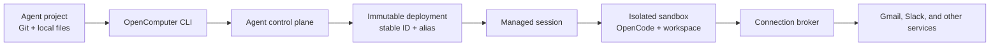
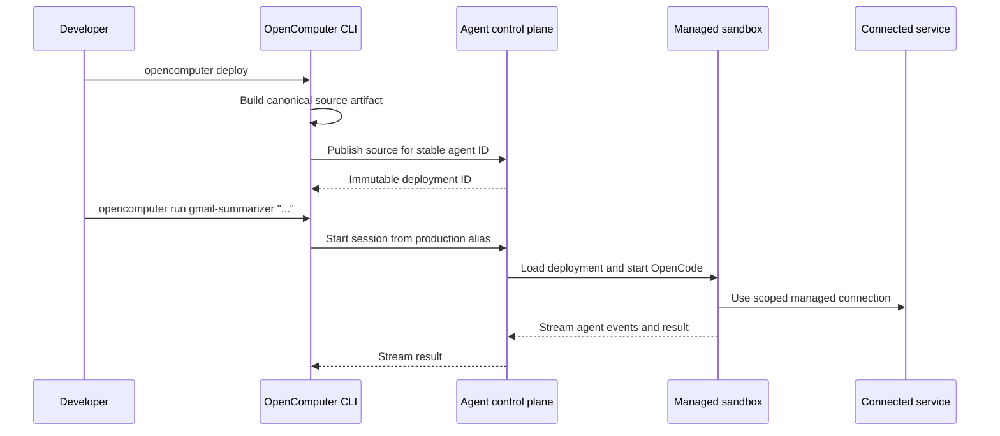

OpenComputer keeps the agent development experience code-first while managing
the infrastructure required to run it. You work with one public surface—the
`opencomputer` CLI—and the same agent project can run locally or in a managed
sandbox.



## The layers

### Agent project

The project is the portable definition of the agent. Its committed files
describe:

- stable identity in `opencomputer.toml`
- behavior and approval rules in `instructions.md`
- runtime and model configuration
- tools and skills
- required connections and channels
- initial workspace files and evaluations

The project contains declarations and code, not provider credentials.

### OpenComputer CLI

The CLI owns the developer workflow:

- discover templates
- initialize a complete project
- authenticate the developer
- authorize managed connections
- run the project locally with OpenCode
- package and deploy the project
- start sessions from deployed agents

When you run `opencomputer deploy`, the CLI builds a canonical source artifact
from the agent directory and sends it to OpenComputer. Infrastructure provider
details are not part of the CLI contract.

### Agent identity and deployments

The `id` in `opencomputer.toml` identifies the agent across its lifetime. Each
distinct source artifact becomes an immutable deployment.

```text
gmail-summarizer
├── deployment A
├── deployment B
└── production ──> deployment B
```

Aliases such as `production` provide a stable target while preserving the
exact source behind every deployment. Deploying unchanged source is
idempotent; deploying changed source creates a new version.

### Managed sessions and sandboxes

A deployed run creates a managed session from the selected agent version.
OpenComputer prepares an isolated sandbox, loads the agent source and
workspace, starts OpenCode, and streams the result back to the CLI.

The sandbox is an implementation detail of the agent experience. You do not
need to create or manage a separate sandbox before deploying an agent.

Each session has:

- the exact deployed source version
- an isolated filesystem and process environment
- a workspace that the agent can use during the task
- access to only the connections and channels declared for that agent
- lifecycle management handled by OpenComputer

### Connections

Connections let agent tools act on services such as Gmail without committing
OAuth tokens to Git.

For Gmail:

<Steps>
  <Step title="Declare">
    The template places a Google connection declaration in
    `connections/google.json`.
  </Step>
  <Step title="Authorize">
    `opencomputer connect google` opens the account authorization flow.
  </Step>
  <Step title="Develop locally">
    The CLI gives the local agent a short-lived, scoped route to the managed
    connection.
  </Step>
  <Step title="Run when deployed">
    The managed session receives the same connection capability inside its
    sandbox. Provider credentials remain outside the project and agent output.
  </Step>
</Steps>

An agent's instructions should still define explicit approval boundaries.
Connection scope controls which service operations are possible; instructions
control when the agent should use them.

The Gmail connection is centralized for the OpenComputer user. Local
development does not create a second local OAuth installation:

```text
                         ┌───────────────────────┐
                         │  OpenComputer user    │
                         └───────────┬───────────┘
                                     │ authorizes once
                         ┌───────────▼───────────┐
                         │ Managed Gmail         │
                         │ connection            │
                         └──────┬─────────┬──────┘
                                │         │
                scoped local    │         │ scoped managed
                capability      │         │ capability
                    ┌───────────▼─┐     ┌─▼──────────────┐
                    │ Local agent │     │ Deployed agent │
                    │ + OpenCode  │     │ + sandbox      │
                    └───────────┬─┘     └─┬──────────────┘
                                │         │
                                └────┬────┘
                                     │
                            ┌────────▼────────┐
                            │    Gmail API    │
                            └─────────────────┘
```

The repository contains only the connection declaration. OAuth credentials
stay outside Git and are never given directly to the model.

## Local and deployed execution

| | Local session | Deployed session |
|---|---|---|
| Source | Current working directory | Immutable deployed artifact |
| Runtime | OpenCode on your machine | OpenCode in an isolated OpenComputer sandbox |
| Connections | Scoped through the local CLI | Scoped through the managed runtime |
| Best for | Iteration and debugging | Durable, repeatable execution |
| Command | `opencomputer session` | `opencomputer session create --remote` or `opencomputer run <agent>` |

This symmetry is intentional: develop the actual agent locally, then deploy
the same directory instead of rebuilding the workflow in a dashboard.

Managed sessions can be listed, inspected, attached to, resumed with another
turn, and ended from the CLI. A session is the durable unit of interaction;
the sandbox runtime may suspend between turns and resume when needed.

## Deployment sequence



## Security boundaries

- Agent source and identity are reviewable and commit-friendly.
- OAuth credentials are managed separately from source code.
- Local connection access uses a scoped session capability.
- Deployed agents run inside isolated sandboxes.
- The public CLI and API do not expose infrastructure-provider credentials or
  storage implementation details.
- Consequential actions should remain behind explicit instructions and user
  approval.

<Card title="Deploy a Gmail summarizer" icon="rocket" href="/agents/quickstart">
  Follow the complete CLI workflow.
</Card>
