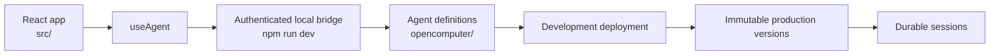

OpenComputer separates application UI from agent definitions while keeping
both in one project repository.

## Project source

The `opencomputer/` tree contains project identity, agents, instructions,
tools, connections, channels, skills, routing, and runtime configuration. The
`src/` tree is a normal React application and can be changed independently.

Projects can contain multiple agents. The initial scaffold creates only
`hello-world`, so the developer can see the complete loop before adding more
behavior.

## Cloud development

`npm run dev` watches agent code and deploys it to Development (Cloud). It also
writes ephemeral connection details inside the selected agent's ignored
`.opencomputer/` directory. `npm run dev:web` starts Vite; its server-side
proxy reads those details and forwards browser requests. The credential is
never bundled into React code.

The generated `useAgent` hook:

- creates a session on the first prompt;
- streams newline-delimited agent events;
- appends assistant message deltas; and
- reuses the session ID for follow-up prompts.

## Environments and versions

Every project starts with a development environment. Local edits can be tested
against the live development agent, then deployed as an immutable version and
promoted through a stable alias such as `production`. Version history remains
available for inspection and rollback.

## Project and session resources

A project owns its agents, deployments, sessions, files shared by agents,
connections, inbound channels, schedules, agent schema, and access tokens.
A session owns its durable log, produced files, agent-written data, and secrets
shared specifically with that session. The model supports a main agent and
subagents with separate logs as that capability is introduced.

The dashboard and CLI call the public OpenComputer API. Runtime and
infrastructure services remain private implementation details.
