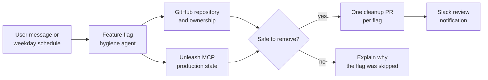

The feature flag hygiene example finds old Unleash release flags that remain in
a repository and prepares one small cleanup pull request per eligible flag. It
combines an interactive agent, remote MCP servers, code-defined tools, a
schedule, and a Slack outbox in one project.

<Card
  title="OpenComputer × Unleash feature flag hygiene"
  icon="github"
  href="https://github.com/diggerhq/opencomputer-example-unleash"
>
  Clone the complete agent, schedule, channel, outbox, and fixture application
  from GitHub.
</Card>

## How it works



For each exact feature-flag reference found in executable code, the agent:

1. inspects the flag's production state through the Unleash MCP server;
2. checks whether it has been live for the configured minimum age;
3. determines the behavior that should survive removal;
4. finds an owner through `CODEOWNERS` or recent file history;
5. runs the narrowest relevant tests;
6. opens one focused pull request per eligible flag; and
7. publishes a deduplicated review request through the Slack outbox.

The agent does not disable, archive, or delete flags in Unleash. Flag retirement
remains a separate action after the cleanup pull request has been reviewed and
deployed.

## Select the capabilities

The agent function attaches the model and capabilities needed by the managed
harness:

```tsx
export default function Agent() {
  const input = useInput();

  useModel("anthropic/claude-sonnet-4.6");
  useMcpServer(unleashMcp);
  useMcpServer(githubPatMcp);

  useTool(cloneRepository);
  useTool(findFileOwners);
  useTool(openCleanupPullRequest);

  // Return the workflow instructions for this render.
}
```

The Unleash MCP server supplies feature-flag state. The GitHub MCP server and
code-defined tools supply repository search, an authenticated source snapshot,
ownership evidence, branch creation, file updates, pull requests, and reviewer
selection.

Both credentials are managed by OpenComputer. They are not placed in agent
source, prompts, commands, tool input, or repository URLs.

## Skip unsafe candidates

The agent refuses to open a pull request when a flag:

- is younger than the minimum-age threshold;
- is not enabled in production;
- appears only in documentation;
- has ambiguous surviving behavior;
- has failing tests;
- has no evidence for an owner; or
- already has an open cleanup branch or pull request.

The screenshot below shows a real interactive run in which all four flags were
skipped. Three were enabled but too young, while one was not enabled in
production. The session reports the evidence instead of making a change.

<Frame>
  
</Frame>

## Run it on a schedule

The example includes a code-defined weekday schedule:

```ts
import { defineSchedule } from "@opencomputer/agent";

export default defineSchedule({
  id: "weekday-hygiene",
  cron: "0 9 * * 1-5",
  timezone: "America/Los_Angeles",
  enabled: ["production"],
  overlap: "skip",
  dispatch: {
    text: "Run the configured feature-flag hygiene review.",
    payload: {
      mode: "async",
      repository: "diggerhq/opencomputer-example-unleash",
      projectId: "feature-example-test",
      productionEnvironment: "production",
      minimumAgeDays: 10,
      githubAuth: "pat",
      dryRun: true,
    },
  },
});
```

Development discovers the schedule but keeps it manual-only by default. Use
**Run now** to test the exact dispatch safely. Production runs it at 9:00 AM
Pacific on weekdays and skips an occurrence when an earlier run is still
active.

The payload's `mode` selects unattended behavior. The transport provenance in
`input.source` remains available for observability, but it is not used as the
agent's business-mode switch.

## Notify reviewers through an outbox

Outside dry-run mode, every created or reused cleanup pull request publishes a
review request to a code-defined outbox. The outbox routes the provider-neutral
message to the `pull-request-reviews` destination on the project's Slack
channel.

Publishing and Slack delivery are separate. A temporary Slack failure does not
turn an already-created GitHub pull request into a failed tool call. Reusing the
same `owner/repository#pull-number:review-request` idempotency key lets the
outbox deduplicate retries.

## Try the fixture safely

After cloning the repository and configuring the documented GitHub and Unleash
development secrets:

```bash
npm install
npm run dev
```

Start with the included fixture and a dry run:

```bash
npm run session -- "Analyze repository diggerhq/opencomputer-example-unleash using Unleash project feature-example-test and production environment. Use minimumAgeDays 0, GitHub PAT mode, and dryRun true."
```

The repository README documents the required token permissions, Slack
destination binding, production deployment, fixture tests, and the deliberate
step from dry-run analysis to pull-request creation.

