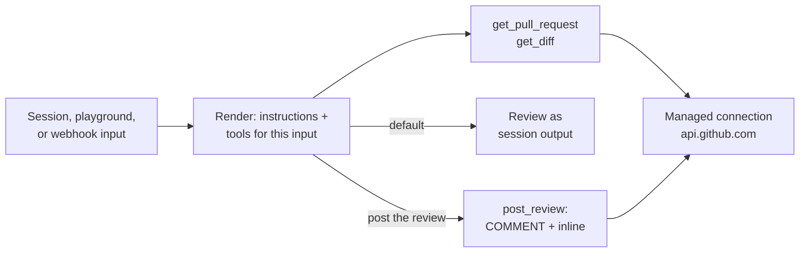

The [Pull Request Reviewer example](https://github.com/diggerhq/opencomputer-example-pr-review)
reviews a GitHub pull request on demand. The agent fetches the PR metadata and
diff through a declared GitHub connection, reviews the change for correctness,
and returns the review as session output. When the request explicitly asks,
it posts a `COMMENT` review: a verdict plus findings, with inline comments
anchored to diff lines:

<Frame>
  
</Frame>

## Structure

**The agent function** (`opencomputer/agents/pr-review/agent.ts`) is a
synchronous render, called before every model step. It reads the current
input and selects the instructions and tool set for that step. The write
tool is attached only when the request asks for a live post:

```tsx
export default function Agent() {
  const input = useInput();
  const live = /\bpost\b.*\breview\b/i.test(input.text ?? "");

  useModel("anthropic/claude-sonnet-4.6");
  useTool(getPullRequest);
  useTool(getDiff);
  if (live) {
    useTool(postReview);
  }

  return live
    ? "…review, then post with post_review and report the review URL."
    : "…review as a dry run. Do not claim to have posted anything.";
}
```

There is no separate permission layer: dry-run-by-default is one `if`
statement, and a tool the render does not select does not exist for that
model step.

**The tools module** (`opencomputer/agents/pr-review/tools/github-tools.ts`)
declares one HTTP connection and three typed tools that use it.
`get_pull_request` and `get_diff` read; `post_review` writes one `COMMENT`
review and falls back to summary-only when GitHub rejects an inline anchor:

```tsx
export const github = defineConnection({
  id: "github-api",
  origin: "https://api.github.com",
  methods: ["GET", "POST"],
  pathPrefix: "/repos/",
  headers: {
    Authorization: bearer(useSecret("GITHUB_TOKEN")),
    "User-Agent": "opencomputer-pr-review-agent",
  },
});
```

The connection defines all outbound access: tools call
`github.fetch("/repos/…")`, and the platform validates origin, method, and
path prefix before attaching the token at its outbound edge. The token never
enters the agent runtime, so a prompt-injected model step cannot read or
exfiltrate it. See [Secrets and runtime variables](/agents/secrets).

**The managed runtime** provides the rest: the durable session and turn
queue, the model/tool loop that calls the render before each step, and
deployments. `npm run deploy -- --watch` builds an immutable
content-addressed deployment on every save and advances the Development
alias; sessions stay pinned to the deployment they started on.



## Run it

<Card
  title="Deploy to OpenComputer"
  icon="rocket"
  href="https://app.opencomputer.dev/new?repository-url=https%3A%2F%2Fgithub.com%2Fdiggerhq%2Fopencomputer-example-pr-review"
>
  Configure the GitHub credential and deploy the agent to Development.
</Card>

[Browse the source on GitHub](https://github.com/diggerhq/opencomputer-example-pr-review).

```bash
git clone https://github.com/diggerhq/opencomputer-example-pr-review.git
cd opencomputer-example-pr-review
npm install
npm run opencomputer -- login
npm run deploy -- --watch
```

Keep the watch command running while testing; it deploys changes to the
Development environment.

## Configure the GitHub token

Create a fine-grained personal access token scoped to the repositories the
agent should review, with **Pull requests: read and write** and
**Contents: read**. Store it as a managed secret:

```bash
npm run opencomputer -- secrets set GITHUB_TOKEN
```

The agent's repository access equals the token's grant: it can read and
review only the repositories selected when the token was created.

## Review a pull request

```bash
npm run session -- "Review acme/widgets#42"
```

The dry-run review is a verdict paragraph plus numbered findings anchored to
files and lines from the diff. Nothing is posted.

To post the review:

```bash
npm run session -- "Review acme/widgets#42 and post the review on the PR."
```

The agent submits one `COMMENT` review — the verdict and findings as the
body, plus inline comments for findings it can anchor to new-side diff
lines. It never approves or requests changes.

## Trigger from another system

```bash
npm run opencomputer -- webhooks create pr-review-ingress \
  --agent current \
  --environment development
```

Each authenticated delivery starts a fresh durable session against the
active deployment and returns HTTP 202 with the session URL; a repeated
`Idempotency-Key` returns the original session instead of starting a second
review. See [Agent webhooks](/agents/webhooks).

GitHub webhooks sign with an HMAC header and cannot supply the bearer
token, so reviewing PRs on open requires a relay — for example a GitHub
Actions `pull_request` job holding the webhook URL and token as repository
secrets.

## Safety properties

- The GitHub token is write-only, attached outside the agent runtime, and
  constrained to declared origin, method, and path prefix.
- The agent's toolset is exactly what the render selects; posting requires
  an explicit request, and dry run is the default.
- Reviews are `COMMENT` events only; the agent cannot approve, request
  changes, merge, or push.
- Diffs above 150,000 characters are truncated, and the tool result reports
  the truncation and full size.
