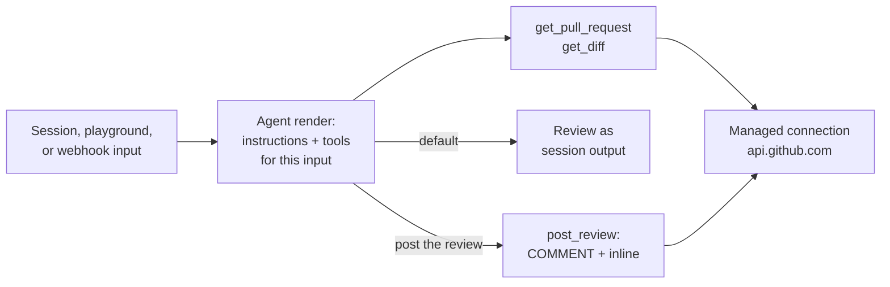

The PR review example reviews a GitHub pull request on demand. The agent
fetches the PR metadata and diff through a declared GitHub connection, reviews
the change for correctness, and returns the review as session output. Only
when the request explicitly asks it to post does the agent submit a `COMMENT`
review with inline comments.

<Frame>
  
</Frame>

## How it works



The agent function selects capabilities per input: the two read tools on
every turn, `post_review` only when the input asks for a live post. A tool
the render does not select does not exist for that model step, and the
review defaults to a dry run.

All three tools call one declared HTTP connection: `https://api.github.com`,
`GET` and `POST`, path prefix `/repos/`, authorized by a managed
`GITHUB_TOKEN` secret. The platform validates destination, method, and path
before attaching the token at its outbound edge; the value never enters the
agent runtime. See [Secrets and runtime variables](/agents/secrets).

## Start with the example

<Card
  title="OpenComputer PR review agent"
  icon="github"
  href="https://github.com/diggerhq/opencomputer-example-pr-review"
>
  Clone the complete agent, tools, and tests from GitHub.
</Card>

```bash
git clone https://github.com/diggerhq/opencomputer-example-pr-review.git
cd opencomputer-example-pr-review
npm install
npm run opencomputer -- login
npm run deploy -- --watch
```

Keep the watch command running while testing; it deploys changes to the
Development environment.

## Configure the GitHub token

Create a fine-grained personal access token scoped to the repositories the
agent should review, with **Pull requests: read and write** and
**Contents: read**. Then store it as a managed secret:

```bash
npm run opencomputer -- secrets set GITHUB_TOKEN
```

The token's grant is the agent's blast radius: it can read and review
exactly the repositories selected when the token was created, and nothing
else.

## Review a pull request

```bash
npm run session -- "Review acme/widgets#42"
```

The dry-run review is a verdict paragraph plus numbered findings anchored to
files and lines from the diff. Nothing is posted.

To post, say so:

```bash
npm run session -- "Review acme/widgets#42 and post the review on the PR."
```

The agent submits one `COMMENT` review — the verdict and findings as the
body, plus inline comments for findings it can anchor to new-side diff
lines. Anchors GitHub rejects fall back to a summary-only review. The agent
never approves or requests changes.

## Trigger from another system

```bash
npm run opencomputer -- webhooks create pr-review-ingress \
  --agent current \
  --environment development
```

Each authenticated delivery starts a fresh durable session against the
active deployment and returns HTTP 202 with the session URL; a repeated
`Idempotency-Key` returns the original session instead of starting a second
review. See [Agent webhooks](/agents/webhooks).

GitHub webhooks sign with an HMAC header and cannot supply the bearer token,
so reviewing PRs on open takes a small relay — for example a GitHub Actions
`pull_request` job holding the webhook URL and token as repository secrets.

## Safety properties

- The GitHub token is write-only, attached outside the agent runtime, and
  constrained to declared origin, method, and path prefix.
- The agent's toolset is exactly what the render selects; posting requires
  an explicit request, and dry run is the default.
- Reviews are `COMMENT` events only; the agent cannot approve, request
  changes, merge, or push.
- Diffs above 150,000 characters are truncated, and the tool result reports
  the truncation and full size.
