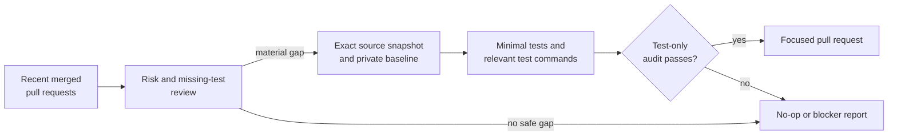

The test coverage example reviews recently merged GitHub pull requests, finds
one meaningful regression risk with weak test coverage, adds the smallest
useful tests, and opens a focused pull request after those tests pass.

It does not optimize for a coverage percentage. Cosmetic changes, generated
files, broad snapshots, and behavior-neutral refactors are not reasons to
create a pull request. A run that finds no material gap finishes without
writing to GitHub.

## How it works



Every run examines a bounded recent-merge window and selects at most one
coherent gap. The agent downloads the exact default-branch commit it inspected,
keeps a private untouched baseline, follows the repository's own test
instructions, and runs the narrowest relevant validation commands.

The publishing tool compares the tested snapshot with the baseline. It rejects
production changes, unlisted paths, deletions, symlinks, and oversized files
before it can write to GitHub.

## Start with the example

<Card
  title="Test coverage agent"
  icon="github"
  href="https://github.com/diggerhq/opencomputer-example-test-coverage"
>
  Clone the complete agent, publishing policy, and policy tests from GitHub.
</Card>

```bash
git clone https://github.com/diggerhq/opencomputer-example-test-coverage.git
cd opencomputer-example-test-coverage
npm install
npm test
npm run typecheck
npm run opencomputer -- login
```

## Configure a fixture repository

Start with a disposable repository containing a recent merged change and a
deliberately missing regression test. Set that fixed destination in
`opencomputer/agents/test-coverage/tools/config.ts`:

```ts
export const TARGET_REPOSITORY = {
  owner: "your-github-owner",
  repository: "coverage-agent-fixture",
  defaultBranch: "main",
} as const;

export const PUBLISH_ENABLED = false;
```

The destination is code-owned. Pull-request text, prompts, commit messages, and
repository files cannot redirect the publishing tool to another repository.

Create a short-lived, fine-grained GitHub token restricted to the fixture
repository with **Contents: read and write** and **Pull requests: read and
write**. Store it as a Development secret through the hidden prompt:

```bash
npm run opencomputer -- secrets set GITHUB_PAT \
  --environment development \
  --agent current
```

The declared connection limits credential injection to GitHub API requests.
The token is not placed in agent source, prompts, repository URLs, or the
runtime environment.

## Test in Development

Watch the source and deploy changes to the remote Development environment:

```bash
npm run deploy -- --watch
```

In another terminal, start an explicit run:

```bash
npm run session -- \
  "Review recent merged code and add the highest-value missing regression tests."
```

With `PUBLISH_ENABLED` set to `false`, the agent can inspect the fixture, edit
its isolated snapshot, run tests, and perform the final audit, but the
publishing tool returns a dry-run result without creating a branch or pull
request.

Review the selected risk, proposed test paths, and observed command results.
If they are correct, set `PUBLISH_ENABLED` to `true`, let the watch deployment
finish, and start a new session with the same request.

The published branch is deterministically named
`test/coverage-<head-sha>`. Repeating the run for the same repository head
returns the existing open pull request rather than creating a duplicate.

## Safety boundaries

- The agent can add or update tests and fixtures, but it cannot publish a
  production-code testability refactor.
- It cannot merge, approve, close, or label pull requests or change repository
  settings.
- Failing, flaky, or environment-dependent tests are reported without
  publishing.
- Repository content and test output are treated as untrusted evidence rather
  than instructions.
- This example starts from explicit interactive runs. Add a recurring schedule
  only after validating the repository-specific workflow and publication
  policy.
