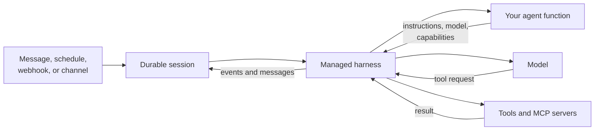
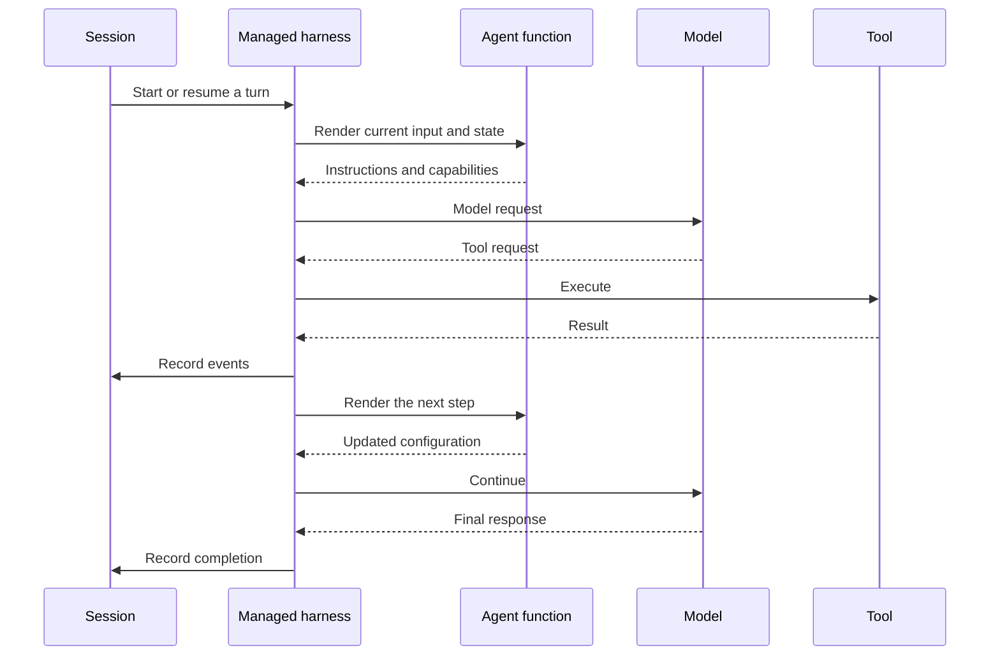
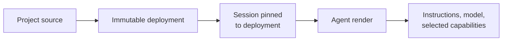

OpenComputer runs agents defined as TypeScript functions. You describe the
agent for the current step; OpenComputer supplies the managed harness that
calls the model, executes tools, streams output, and records the durable
session.



## The runtime model

### Your agent function describes the next step

The default export is a synchronous function. It reads the current input,
selects resources with hooks, and returns instructions:

```tsx
import { useInput, useModel, useTool } from "@opencomputer/agent";
import { inspectRepository } from "./tools/inspect-repository";

export default function Agent() {
  const input = useInput();

  useModel("anthropic/claude-sonnet-4.6");
  useTool(inspectRepository);

  return `
    You are a release-readiness agent.
    Inspect the repository before giving a RELEASE or DO NOT RELEASE verdict.

    Current request: ${input.text ?? "Review the configured repository."}
  `;
}
```

The function does not call the model or execute the tool. Each hook contributes
to the effective configuration for the next model step.

### The harness performs the loop

OpenComputer owns the agent harness. For each step it:

1. renders the agent function;
2. builds a model request from the returned instructions and selected resources;
3. streams the model response;
4. validates and executes requested tools;
5. records the resulting events; and
6. renders again when another model step is required.



Because a function can render more than once during a turn, keep it synchronous
and free of external side effects. Network calls and mutations belong in
[tools](/agents/tools) or remote [MCP servers](/agents/mcp).

### A session makes execution durable

A [session](/agents/sessions) stores the conversation and runtime events across
turns. Clients can disconnect, reconnect, and continue without reconstructing
the agent's history themselves.

Every session remains pinned to the immutable deployment it started with. A
new development sync or production deployment affects new sessions, not code
already running inside an existing session.

## Capabilities are selected, not executed, during render

Use the narrowest capability that fits the work:

| Capability | What the harness receives |
| --- | --- |
| `useTool(tool)` | One typed operation implemented by your project |
| `useMcpServer(server)` | A collection of tools advertised by a remote MCP server |
| `useSubagent(agent)` | Another project agent available for delegation |
| A skill under `skills/` | Reusable instructions and supporting resources |

The model decides whether to request an available tool. The harness remains
responsible for validating the request, executing it, and recording the
result. See [Agent capabilities](/agents/capabilities) for the full comparison.

## Deployment registers; rendering selects

A deployment packages the agents and resources that are allowed to exist. A
render selects which of those resources are available for one model step.



Development and Production point to different deployments and keep operational
configuration—such as secrets, schedule state, webhook tokens, and channel
bindings—separate. Read
[Deployments and environments](/agents/deployments) for that lifecycle.

## Remember this

> **The agent function decides what the agent is for this step.**  
> **The harness decides how to run that step.**  
> **The session remembers what happened.**

## Explore each concept

<CardGroup cols={2}>
  <Card title="Reactive agents" icon="code" href="/agents/reactive-agents">
    Define instructions and select resources with ordinary TypeScript.
  </Card>
  <Card title="Sessions and turns" icon="comments" href="/agents/sessions">
    Understand durable conversations and runtime events.
  </Card>
  <Card title="Capabilities" icon="shapes" href="/agents/capabilities">
    Choose between tools, MCP servers, skills, and subagents.
  </Card>
  <Card title="Schedules" icon="clock" href="/agents/schedules">
    Start recurring sessions from code-defined cron schedules.
  </Card>
  <Card title="Webhooks" icon="webhook" href="/agents/webhooks">
    Start sessions from authenticated external services.
  </Card>
  <Card title="Channels and outboxes" icon="message" href="/agents/channels">
    Receive conversational events and publish durable notifications.
  </Card>
</CardGroup>
